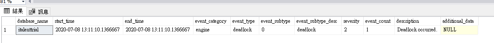

# Check Current Deadlock
* [source1][source1]
* [mssql-tips][mssql-tip]
* [`sys.fn_xe_telementry_blob_target_read_file()`][fn_xe_telemetry_read_file]
* [`sys.event_log`][sys.log_event]

## What They Provide
Essentially, both `sys.fn_xe_telementry_blob_target_read_file()` and `sys.event_log` provide list of events only limited to `login` and `deadlock` (`sys.fn_xe_telementry_blob_target_read_file('df',null,null,null)` for `deadlock` events and first param with `'el'` for two types).

## Quick List `deadlock` Events
Run it against `master`
```sql
SELECT * 
FROM sys.event_log 
WHERE event_type like 'deadlock'
order by start_time desc
```


## By `sys.fn_xe_telemetry_blob_target_read_file()` function
```sql
WITH CTE AS (
	SELECT CAST(event_data AS XML)  AS [target_data_XML]
	FROM sys.fn_xe_telemetry_blob_target_read_file('dl', null, null, null)
)
SELECT target_data_XML.value('(/event/@timestamp)[1]', 'DateTime2') AS Timestamp,
target_data_XML.query('/event/data[@name=''xml_report'']/value/deadlock') AS deadlock_xml,
target_data_XML.query('/event/data[@name=''database_name'']/value').value('(/value)[1]', 'nvarchar(100)') AS db_name
FROM CTE
```

TEST:  
-- _session_one_ --
```sql
begin transaction

select top 1 *
from [table_1] with (updlock)

-- wait for 50 seconds
waitfor delay '00:00:50'

select top 1 * 
from [table_2] with(updlock)
rollback
```

-- _session_two_ --
```sql
begin transaction

select top 1 * 
from [table_2] with(updlock)

select top 1 *
from [table_1] with (updlock)

waitfor delay '00:00:10'
rollback
```

Steps:
1. run `_session_one_`
2. run `_session_two_`
3. run the check query  

Similar output in [deal_lock_sample.xml](deal_lock_sample.xml)

[source1]: https://techcommunity.microsoft.com/t5/azure-database-support-blog/lesson-learned-19-how-to-obtain-the-deadlocks-of-your-azure-sql/ba-p/368847 
[fn_xe_telemetry_read_file]: https://dotblogs.com.tw/jamesfu/2018/07/29/deadlock-analysis-for-sql-azure-database
[sys.log_event]: https://docs.microsoft.com/en-us/sql/relational-databases/system-catalog-views/sys-event-log-azure-sql-database?view=azuresqldb-current
[mssql-tip]: https://www.mssqltips.com/sqlservertip/5658/capturing-sql-server-deadlocks-using-extended-events/


