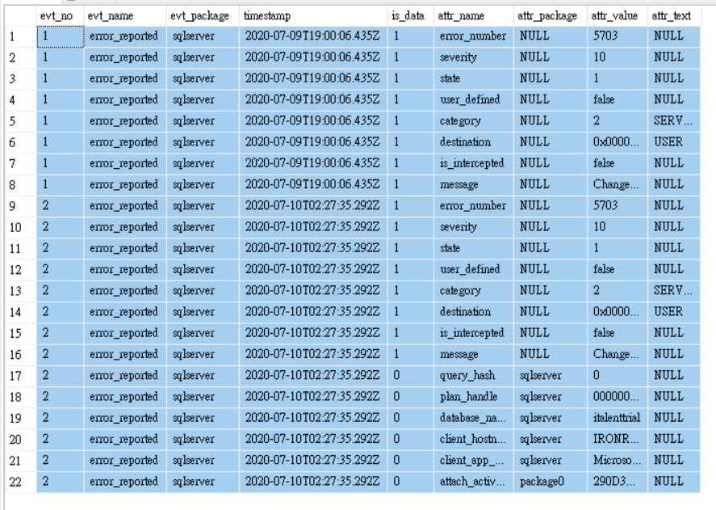

# Mssql XML Data
* with `openxml`
* with [`xpath`][doc] family function like
    * `nodes()` return `table(col)`
    * `query()` return `xml` data
    * `value()` may return more than one results
    * `exits()`
    * `is null`

Given xEvent data  
Ring buffer target data with two events:

```sql
declare @xml xml = '<RingBufferTarget truncated="0" processingTime="94" totalEventsProcessed="5084" eventCount="1000" droppedCount="0" memoryUsed="414294">
  <event name="error_reported" package="sqlserver" timestamp="2020-07-09T19:00:06.435Z">
    <data name="error_number">
      <type name="int32" package="package0"></type>
      <value>5703</value>
    </data>
    <data name="severity">
      <type name="int32" package="package0"></type>
      <value>10</value>
    </data>
    <data name="state">
      <type name="int32" package="package0"></type>
      <value>1</value>
    </data>
    <data name="user_defined">
      <type name="boolean" package="package0"></type>
      <value>false</value>
    </data>
    <data name="category">
      <type name="error_category" package="sqlserver"></type>
      <value>2</value>
      <text><![CDATA[SERVER]]></text>
    </data>
    <data name="destination">
      <type name="error_destination" package="sqlserver"></type>
      <value>0x00000002</value>
      <text><![CDATA[USER]]></text>
    </data>
    <data name="is_intercepted">
      <type name="boolean" package="package0"></type>
      <value>false</value>
    </data>
    <data name="message">
      <type name="unicode_string" package="package0"></type>
      <value><![CDATA[Changed language setting to us_english.]]></value>
    </data>
  </event>
<event name="error_reported" package="sqlserver" timestamp="2020-07-10T02:27:35.292Z">
    <data name="error_number">
      <type name="int32" package="package0"></type>
      <value>5703</value>
    </data>
    <data name="severity">
      <type name="int32" package="package0"></type>
      <value>10</value>
    </data>
    <data name="state">
      <type name="int32" package="package0"></type>
      <value>1</value>
    </data>
    <data name="user_defined">
      <type name="boolean" package="package0"></type>
      <value>false</value>
    </data>
    <data name="category">
      <type name="error_category" package="sqlserver"></type>
      <value>2</value>
      <text><![CDATA[SERVER]]></text>
    </data>
    <data name="destination">
      <type name="error_destination" package="sqlserver"></type>
      <value>0x00000002</value>
      <text><![CDATA[USER]]></text>
    </data>
    <data name="is_intercepted">
      <type name="boolean" package="package0"></type>
      <value>false</value>
    </data>
    <data name="message">
      <type name="unicode_string" package="package0"></type>
      <value><![CDATA[Changed language setting to us_english.]]></value>
    </data>
    <action name="query_hash" package="sqlserver">
      <type name="uint64" package="package0"></type>
      <value>0</value>
    </action>
    <action name="plan_handle" package="sqlserver">
      <type name="binary_data" package="package0"></type>
      <value>0000000000000000000000000000000000000000000000000000000000000000000000000000000000000000</value>
    </action>
    <action name="database_name" package="sqlserver">
      <type name="unicode_string" package="package0"></type>
      <value><![CDATA[italenttrial]]></value>
    </action>
    <action name="client_hostname" package="sqlserver">
      <type name="unicode_string" package="package0"></type>
      <value><![CDATA[IRONROGER]]></value>
    </action>
    <action name="client_app_name" package="sqlserver">
      <type name="unicode_string" package="package0"></type>
      <value><![CDATA[Microsoft SQL Server Management Studio]]></value>
    </action>
    <action name="attach_activity_id" package="package0">
      <type name="activity_id" package="package0"></type>
      <value>290D3B2D-6DD8-4881-9974-454BEAF0DFD2-1450</value>
    </action>
  </event>
</RingBufferTarget>'
```

## `xPath` Functions
Select top-level(root) tag attributes:
```sql
select
	content.value('@truncated', 'int') truncated,
	content.value('@processingTime', 'nvarchar(10)') processingTime,
	content.value('@totalEventsProcessed', 'int') totalEventsProcessed,
	content.value('@eventCount', 'int') eventCount,
	content.value('@droppedCount', 'int') droppedCount,
	content.value('@memoryUsed', 'int') memoryUsed
from @xml.nodes('/RingBufferTarget') root_tag(content)
```
truncated|processingTime|totalEventsProcessed|eventCount|droppedCount|memoryUsed
---|---|---|---|---|---
0|94|5084|1000|0|414294

List sub-elements (event) from the root:
```sql
;with evts(evt_no, evt) as (
	select
		row_number() over(order by (select null)), 
		evt.query('.') as evt_xml -- cannot directly refer to evt
	from @xml.nodes('/RingBufferTarget/event') evts(evt)
)
select
		evt_no,
        -- select top-level attribute
        -- [1] at the end makes it singleton result
		evt_name = evt.value('(/event/@name)[1]', 'varchar(50)'),
		evt_package = evt.value('(/event/@package)[1]','varchar(50)'),
		[timestamp] = evt.value('(/event/@timestamp)[1]', 'varchar(24)'),
		
		attr.*
	from evts
    -- expand on evt data as xml
	outer apply (
		select
			1 is_data,
			dt.value('@name', 'varchar(50)') attr_name,
			dt.value('@package', 'varchar(50)') attr_package,
			dt.value('value[1]', 'varchar(max)') attr_value,
			dt.value('text[1]', 'varchar(max)') attr_text
		from evt.nodes('/event/data') evt(dt)
	
		union all

		select
			0 is_data, 
			act.value('@name', 'varchar(50)') attr_name,
			act.value('@package', 'varchar(50)') attr_package,
			act.value('value[1]', 'varchar(max)') attr_value,
			act.value('text[1]', 'varchar(max)') attr_text
		from evt.nodes('/event/action') evt(act)
	) attr
```
Output


[doc]: https://docs.microsoft.com/en-us/sql/t-sql/xml/value-method-xml-data-type?view=sql-server-ver15